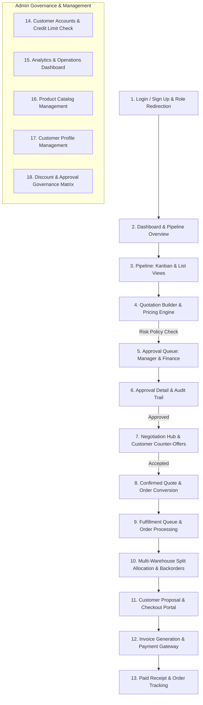

# odoo_finals_622
# Implementation Plan: DealFlow360 End-to-End Functional Platform

## Problem & Background Context
DealFlow360 is conceived as a revenue operations platform connecting the entire commercial lifecycle:
**Customer Request (RFQ) → Quotation Builder & Pricing → Risk & Governance Approvals → Customer Negotiation → Order Conversion → Multi-Warehouse Fulfillment & Split Allocation → Invoicing & Payment Gateway → Analytics & Governance Rules Configuration**.

### Current Codebase Assessment: Why it is mostly non-functional
1. **Frontend (`client/src/main.tsx`)**:
   - Currently a condensed ~16-line prototype.
   - The **"+ New Quotation"** button has empty `onClick` handlers and does not open a builder.
   - **Quotation Details** cannot add, edit, or delete line items, cannot recalculate risk interactively, and cannot submit for approval.
   - **Approval Queue** has no approve/reject/return buttons or modal with audit notes.
   - **Negotiation Hub** does not render messages or provide an interactive chat box for counter-offers.
   - **Fulfillment** is a 2-column static table without a warehouse allocation modal or split shipment mechanism.
   - **Billing** cannot generate invoices from orders, and has no checkout/payment modal to mark invoices as PAID.
   - **Customer RFQ/Requests** are missing from the navigation and UI.
   - **Product Catalog & Customer Profiles** are read-only cards without Add/Edit capability.
   - **Governance Matrix** (discount ceilings by category & tier, approval rules) and **Analytics Dashboard** are completely missing.
2. **Backend (`server/src/server.ts`)**:
   - Only basic endpoints exist; missing CRUD for discount rules, customer credit limits, payment processing, invoice generation upon order confirmation, and inventory adjustments.
   - No payment endpoint exists (`/api/invoices/:id/pay`).
   - Customer credit limits are not tracked in the Prisma schema or verified before order confirmation.

---

## User Review Required

> [!IMPORTANT]
> **Database Schema Enhancements**: We will update `prisma/schema.prisma` to add:
> - `Customer`: `creditLimit` (default 500,000), `paymentTerms` (e.g. `NET_30`), `phone`, `address`.
> - `Invoice`: `dueDate`, `paidAt`, `paymentMethod`, `transactionRef`.
> We will run `npx prisma db push` to keep existing SQLite data or re-seed it with the enhanced demo dataset.

> [!NOTE]
> **Role-Based Experience & Fast Switcher**:
> The UI will include a prominent **Demo Role Switcher** at the top (Admin, Sales Rep, Manager, Finance, Customer) so you can test every single step of the flow in seconds without logging out and in repeatedly.

---

## Proposed Architectural Flow (Matching Uploaded Diagram)

The 18-step workflow from the uploaded diagram (*"DealFlow360 - End-to-End Product Flow"*):

---

## Proposed Changes

### Component 1: Database & Backend Enhancements

#### [MODIFY] `server/prisma/schema.prisma`
- Add `creditLimit`, `paymentTerms`, `phone`, `address` to `Customer`.
- Add `paidAt`, `paymentMethod`, `transactionRef`, `dueDate` to `Invoice`.
- Support tier max discount configuration in schema or seeded rules.

#### [MODIFY] `server/prisma/seed.ts`
- Populate realistic demo credit limits, warehouses (Main Warehouse Bengaluru, East Depot Hyderabad, West Hub Mumbai), inventory stock levels, discount rules, and sample customer RFQs.

#### [MODIFY] `server/src/server.ts`
Implement and expand clean RESTful APIs:
- **Auth & Profiles**: `/api/auth/login`, `/api/auth/signup`, `/api/me`.
- **Customer Requests (RFQ)**:
  - `GET /api/requests`
  - `POST /api/requests` (Customer creates RFQ)
  - `POST /api/requests/:id/convert` (Sales rep converts RFQ to quote)
- **Quotations**:
  - `GET /api/quotes` (filtering, search, pagination)
  - `POST /api/quotes` (create draft quote)
  - `GET /api/quotes/:id` (detailed view with line calculations, risk analysis, audit logs, messages)
  - `POST /api/quotes/:id/items` (add line item with product, qty, discount%)
  - `PATCH /api/quotes/:id/items/:itemId` (update line item)
  - `DELETE /api/quotes/:id/items/:itemId` (delete line item)
  - `POST /api/quotes/:id/submit` (governance risk evaluation, status shift to `PENDING_APPROVAL` or `APPROVED`)
  - `POST /api/quotes/:id/confirm` (confirm quote, credit limit validation, generates `Order` + `Invoice`)
- **Approvals & Governance**:
  - `GET /api/approvals` (manager/finance queues)
  - `POST /api/approvals/:id/:action` (`approve`, `reject`, `return` with mandatory audit notes, auto-escalation to Finance for HIGH risk)
- **Negotiation Thread**:
  - `GET /api/quotes/:id/messages`
  - `POST /api/quotes/:id/messages` (add message, updates status to `NEGOTIATION`)
  - `POST /api/quotes/:id/accept` (customer directly accepts quote)
- **Fulfillment & Multi-Warehouse**:
  - `GET /api/fulfillment` (orders with allocations, backorders)
  - `GET /api/warehouses` (live inventory across warehouses)
  - `POST /api/orders/:id/allocate` (multi-warehouse split allocation, stock reservation, backorder creation)
- **Billing & Payment**:
  - `GET /api/billing` (invoices & subscriptions)
  - `GET /api/invoices/:id` (invoice detail)
  - `POST /api/invoices/:id/pay` (simulated payment gateway: card, UPI, wire; marks `PAID` with transaction ref)
- **Product & Customer Management**:
  - `POST /api/products`, `PATCH /api/products/:id`, `DELETE /api/products/:id`
  - `POST /api/customers`, `PATCH /api/customers/:id`
- **Governance Rules Matrix**:
  - `GET /api/governance` (current discount ceilings and approval rules)
  - `PUT /api/governance/discount-rules` (update ceilings)
  - `PUT /api/governance/approval-rules` (update approval triggers)
- **Analytics**:
  - `GET /api/dashboard/analytics` (cycle times, win rates, discount variance, fulfillment rate)

---

### Component 2: Frontend Architecture & UI Views

We will modularize the frontend into structured components under `client/src/`:
- `src/types/index.ts`: Strongly typed interfaces for Quote, Customer, Product, Order, Invoice, Warehouse, User, Risk, etc.
- `src/api.ts`: API client with token management and helper functions.
- `src/components/Navbar.tsx`: Top header with User badge, live backend indicator, and **1-click Role Switcher** (`Admin`, `Sales Rep`, `Manager`, `Finance`, `Customer`).
- `src/components/Sidebar.tsx`: Navigation sidebar with badge counts for Pending Approvals and Requests.
- `src/components/DashboardView.tsx`: KPI cards, Deal velocity, Action center, RFQ conversion reminders.
- `src/components/PipelineView.tsx`: **Kanban Board** with drag-and-drop / column status progression (Draft → Pending Approval → Approved → Negotiation → Confirmed/Fulfilling) + switchable Table list view.
- `src/components/QuoteBuilderModal.tsx`:
  - Customer selection with Customer Tier and Credit Limit preview.
  - Interactive line item creator: select product, view SKU & unit price, specify quantity and discount %.
  - Real-time margin calculator & category ceiling alert (e.g. "Hardware ceiling is 15% - currently 20% (+5% excess)").
  - Real-time Blended Risk Score meter (LOW, MEDIUM, HIGH) and policy trigger summary.
  - "Save Draft" & "Submit for Review" actions.
- `src/components/QuoteDetailView.tsx`:
  - Visual Stepper Pipeline: `Draft` → `Manager Review` → `Finance Review` → `Approved` → `Order / Fulfillment` → `Invoice Paid`.
  - Line items table with snapshot prices, category limit alerts, subtotal, discount, grand total.
  - Interactive Negotiation Chat tab (send counter-proposals, update status to Negotiation, customer Accept button).
  - Approval action drawer for Managers/Finance (Approve, Return, Reject with notes).
  - One-click "Confirm Deal & Convert to Order" button.
- `src/components/RequestsView.tsx`:
  - Customer RFQ creation (select products, quantities, commercial notes).
  - Sales Rep RFQ inbox with 1-click "Convert to Quote" (pre-populates quote items!).
- `src/components/ApprovalsView.tsx`:
  - Dedicated Governance queue tabbed by Stage (Manager vs Finance).
  - Risk badges, discount violation signals, fast action modal.
- `src/components/FulfillmentView.tsx` & `AllocateModal.tsx`:
  - Order list with status badges (`ALLOCATING`, `SPLIT_PENDING`, `BACKORDERED`, `FULFILLED`).
  - Interactive Multi-Warehouse Split Allocation modal:
    - Lists all warehouses (Main Warehouse Bengaluru, East Depot Hyderabad, etc.) with real available quantities.
    - Split quantities across warehouses.
    - Automatic Backorder calculation if required qty > available stock.
- `src/components/BillingView.tsx` & `PaymentModal.tsx`:
  - Invoices list with status filter (`ALL`, `UNPAID`, `PAID`).
  - Interactive Payment Modal: select payment method (Credit Card, UPI, Net Banking, Wire Transfer), input simulated card/reference, submit instant payment.
  - Printable / downloadable Payment Receipt modal with Invoice #, Order #, Paid timestamp, and Transaction Reference.
- `src/components/ProductsView.tsx`:
  - Product catalog with warehouse stock badges, Add Product modal, and Edit Product modal.
- `src/components/CustomersView.tsx`:
  - Customer account list with Tier badges, Credit Limit, Current Exposure bar, Add/Edit Customer modal.
- `src/components/GovernanceView.tsx`:
  - Interactive matrix for Category Discount Ceilings (Hardware, Service, Subscription) and Tier Discounts.
  - Approval Rule configuration (Medium/High risk triggers, Finance escalation).
  - Actively saves to backend via PUT `/api/governance/...`.
- `src/components/AnalyticsView.tsx`:
  - Visual analytics dashboard: Revenue by category, Deal turnaround times, Risk distribution, Fulfillment split stats.

---

## Verification Plan

### Automated Build & Test
- Run `npm run --prefix server build` to verify all TypeScript types and endpoints compile without errors.
- Run `npm run --prefix client build` to verify all React components, icons, and types compile cleanly.
- Run `npm run seed --prefix server` to verify database seeding.

### Manual End-to-End Walkthrough
1. **Login & Role Switcher**:
   - Log in as `sales@dealflow.demo` or use the 1-click switcher.
2. **Customer RFQ to Quote**:
   - Switch to Customer (`customer@dealflow.demo`), submit a new Request for 3 laptops and 1 installation service.
   - Switch back to Sales Rep, view the request, click "Convert to Quote".
3. **Quotation Builder & Risk Engine**:
   - Open the generated quote, add a discount that exceeds category policy (e.g. 25% discount).
   - Observe real-time Risk Score change to HIGH and note warning that Manager & Finance approval is required.
   - Click "Submit for Approval".
4. **Governance Approval**:
   - Switch to Manager (`manager@dealflow.demo`), view the Approval Queue, click "Approve" with note.
   - Observe status advance to Finance review stage because it is HIGH risk.
   - Switch to Finance (`finance@dealflow.demo`), view queue, click "Approve" with note.
   - Observe status advance to `APPROVED`.
5. **Customer Negotiation & Acceptance**:
   - Switch to Customer, open the quote, post a negotiation comment.
   - Observe quote state updates to `NEGOTIATION`.
   - Click "Accept & Proceed".
6. **Order Conversion**:
   - Switch to Sales Rep, click "Confirm Deal & Convert to Order".
   - Verify Order `ORD-XXXX` and Invoice `INV-XXXX` are created.
7. **Multi-Warehouse Fulfillment**:
   - Switch to Operations/Admin, open Fulfillment.
   - Open Multi-Warehouse Allocation modal, allocate 2 units from Bengaluru and 1 from Hyderabad.
   - Verify fulfillment allocation and order status updates to `FULFILLED`.
8. **Checkout & Payment**:
   - Switch to Customer, navigate to Billing.
   - Click "Pay Now" on the unpaid invoice, select payment method (Credit Card/UPI), submit payment.
   - Verify invoice turns to `PAID` with transaction reference and instant receipt.
9. **Governance Matrix**:
   - Switch to Admin, navigate to Governance Matrix.
   - Edit Hardware discount ceiling from 15% to 20%, click "Save Rules", and verify changes persist across page refresh.

Repository of Team 622 in Odoo Finals
